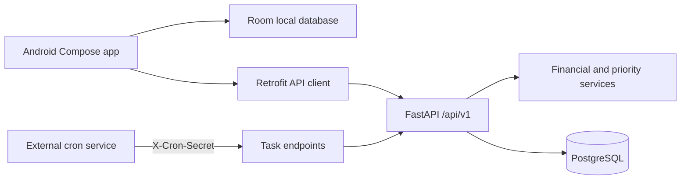
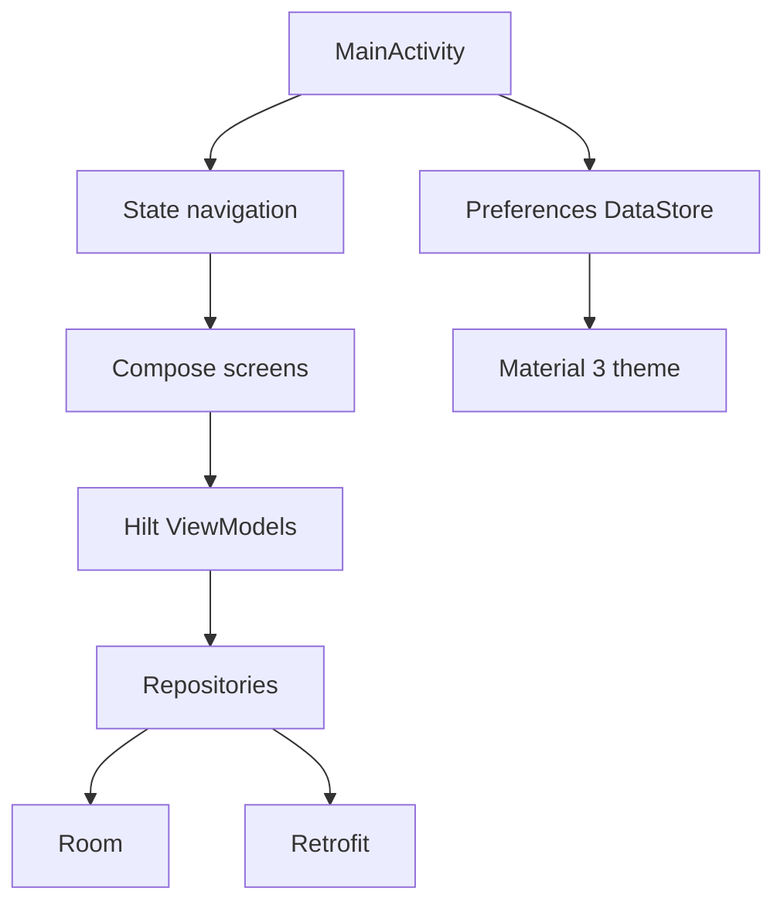

# Architecture

## System overview

## Backend

The backend is organized by responsibility:

- `app/api/v1`: HTTP routers for auth, accounts, transactions, debts, goals and scheduled tasks.
- `app/schemas`: Pydantic request and response contracts.
- `app/models`: SQLAlchemy 2.0 async entities and relationships.
- `app/services`: deterministic financial calculations and priority scoring.
- `app/core`: settings, database session, JWT security and request dependencies.
- `migrations`: Alembic migration history.

The application starts through `app.main`. In development, the lifespan creates tables and ensures the initial user exists. Production deployments should use Alembic as the source of schema changes.

## Priority scoring

`app/services/priority_engine.py` produces a score from 0 to 100. Higher values are more urgent.

- Debts: manual priority, overdue status, due date, interest rate and remaining ratio.
- Goals: manual priority, progress, emergency category and target date.
- Paid or completed items receive score zero.

The debt and goal list endpoints sort by this calculated score while preserving the manual `priority` field for user input.

## Android

### Local data

Room stores accounts, transactions, debts, goals and wishlist items. Schema migrations are registered in `DatabaseModule`:

- Version 1: foundation entities.
- Version 2: goals.
- Version 3: wishlist items.

### Synchronization

Repositories push entities whose `syncStatus` is not `synced`, then pull remote entities. Network errors are intentionally non-fatal so the local database remains usable.

### Shared links

`MainActivity` accepts `ACTION_SEND` with `text/plain`. The shared text is passed to Wishlist, where the user can add a name and estimated price before saving it locally and synchronizing it with `/api/v1/goals/wishlist`.

### Theme settings

`SettingsRepository` stores `SYSTEM`, `LIGHT` or `DARK` in Preferences DataStore. `MainActivity` observes the setting and passes the resolved value to `LifeOSTheme`.

## External integrations

- Telegram delivery is implemented by `TelegramService` and used by the daily and weekly cron endpoints. Missing credentials disable delivery without failing the financial summary.
- AI insights are exposed at `/api/v1/insights/financial` and select Gemini or OpenAI from `AI_PROVIDER`.
- Transaction locations open Google Maps search URLs from the Android client. No Maps SDK key is required for this link-based integration.

## API boundaries

The Android client uses the following Retrofit groups:

- `/auth`
- `/accounts`
- `/transactions`
- `/debts`
- `/goals`
- `/goals/wishlist`

JWT is read from encrypted preferences and attached by the OkHttp interceptor.

## Deployment

The backend is containerized with the root `backend/Dockerfile` and described by `backend/render.yaml`. Render should provide at least `DATABASE_URL`, `SECRET_KEY`, admin credentials and `CRON_SECRET` as secret environment variables.
