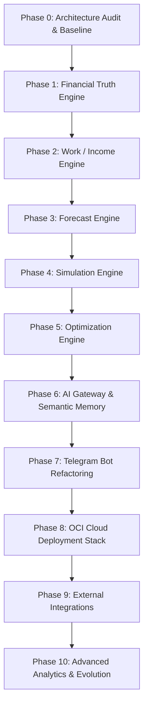

# LifeOS — Master Implementation Roadmap (Phases 0 – 10)

Date: 2026-09-16  
Repository: `Andresfinanzas` / `LifeOS`  
Architecture Standard: LifeOS Master Architecture v2

---

## Roadmap Overview

---

## Phase 0: Architecture Audit & Baseline (Completed)
- [x] Comprehensive code and dependency review of Android and Backend.
- [x] Verification of existing test suite (`python -m pytest`).
- [x] Identification of offline-first vulnerabilities (resurrection bug, unqueued mutations).
- [x] Generation of `CURRENT_STATE.md`, `ARCHITECTURE_GAPS.md`, `IMPLEMENTATION_PLAN.md`, and `DEPLOYMENT.md`.

---

## Phase 1: Financial Truth Engine (Immediate Next Phase)

### Objective
Create a 100% deterministic, non-probabilistic financial calculation engine with zero AI dependency.

### Backend Tasks:
1. **Domain Package Structure**:
   - Establish `app/domain/finance/` containing pure calculation classes:
     - `BalanceCalculator`: Account balances, active vs excluded totals.
     - `ObligationEngine`: Monthly recurring commitments, remaining commitments, debt obligations.
     - `MoneyAllocationEngine`:
       - `available_cash`
       - `protected_cash` (hard constraints: obligations + emergency fund minimum + partner reserve)
       - `free_cash` (`available_cash - protected_cash`)
     - `FinancialHealthEngine`:
       - Liquidity ratio, debt pressure ratio, obligation coverage ratio, savings velocity.
       - Composite score $H \in [0, 100]$.
       - Evaluator returning status **RED / YELLOW / GREEN** with transparent explanation string.
2. **API & Endpoints**:
   - Refactor `/api/v1/accounts/summary` and `/api/v1/accounts/dashboard` to use new domain calculators.
   - Add `/api/v1/finance/health` endpoint returning detailed indicators, score, and state.
3. **Database Schema Update**:
   - Add `financial_snapshots` table for daily/monthly historical health records.
   - Establish first official versioned Alembic migration in `migrations/versions/`.
4. **Android Client Synchronization**:
   - Implement local domain calculations in Android domain layer to ensure RED/YELLOW/GREEN and Free Money work 100% offline in Room.
5. **Unit Tests**:
   - Comprehensive test suite in `backend/tests/domain/test_financial_truth.py` covering edge cases, negative balances, and zero division.

---

## Phase 2: Work & Income Engine

### Objective
Enable tracking of work sessions, hourly earnings rate, and rolling income velocity.

### Tasks:
1. **Backend Model & Endpoints**:
   - Create `WorkSession` model (`id`, `user_id`, `start_time`, `end_time`, `duration_minutes`, `income`, `activity_type`, `location`, `notes`, `created_at`, `updated_at`, `deleted_at`, `version`).
   - Create CRUD API endpoints `/api/v1/work-sessions`.
   - Implement domain calculation services:
     - `income_per_hour` for individual sessions.
     - 7-day and 30-day rolling income per hour.
     - Daily/weekly/monthly target fulfillment metrics.
2. **Android Implementation**:
   - Create Room `WorkSessionEntity` and `WorkSessionDao`.
   - Build `WorkSessionScreen` in Jetpack Compose to quickly start/stop timers or record past shifts.
   - Work session data reflected in Room and visible offline.

---

## Phase 3: Forecast Engine

### Objective
Provide statistical, deterministic projections of future cash flow and income without neural network overhead.

### Tasks:
1. **Statistical Models**:
   - Baseline Naive (last period carry-forward).
   - Rolling Mean (7-day / 30-day sliding window).
   - Exponentially Weighted Moving Average (EWMA) with configurable decay factor $\alpha$.
   - Day-of-Week Seasonality adjustment (e.g. weekend vs weekday income).
   - Work-based projection ($\text{projected hours} \times \text{rolling rate}$).
2. **Output Contract**:
   - Return structured projection: `forecast`, `lower_bound` ($\mu - 2\sigma$), `upper_bound` ($\mu + 2\sigma$), `confidence_score`, `model_used`, `data_points_count`.
3. **Unit Tests**:
   - Test forecast convergence and stability against synthetic time series data.

---

## Phase 4: Simulation Engine

### Objective
Allow the user to test hypothetical scenarios without mutating real financial data.

### Tasks:
1. **Branching Model**:
   - Input: Current financial state + hypothetical events (e.g. "Spend $200,000 COP", "Work 12 extra hours", "Income drops 20%").
   - Execution: Pure in-memory state transition: $S_{\text{sim}} = f(S_{\text{current}}, \Delta E)$.
   - Output:
     - `current_projection` vs `simulated_projection`
     - Impact on target dates for active goals
     - Impact on cash flow and Free Money
     - Change in Financial Health status (e.g. GREEN $\to$ YELLOW)
2. **Endpoints**:
   - `/api/v1/simulation/expense`
   - `/api/v1/simulation/purchase-impact`

---

## Phase 5: Optimization Engine

### Objective
Solve complex allocation and debt payoff problems using mathematical optimization.

### Tasks:
1. **Optimization Library**:
   - Integrate **Google OR-Tools** (Linear Programming / Mixed Integer Programming).
2. **Problem Formulations**:
   - Debt Payoff Strategy: Optimize allocation of extra payments across debts to minimize total interest paid subject to monthly cash flow constraints.
   - Goal Allocation: Optimize monthly savings distribution across competing goals based on deadline and priority weight.
3. **Safety Fallback**:
   - If OR-Tools finds an infeasible state or fails, fall back gracefully to deterministic heuristic (Avalanche/Snowball).

---

## Phase 6: AI Gateway & Semantic Memory

### Objective
Isolate AI interactions behind a clean Gateway with typed tool execution and long-term memory.

### Tasks:
1. **AI Gateway**:
   - `LLMProvider` interface with `GeminiProvider` and `OpenAIProvider` implementations.
   - `ModelRouter`: Route routine formatting to fast/cheap models (Gemini Flash) and complex reasoning to capable models.
2. **Typed Tools Registry**:
   - Implement typed functions that call the deterministic engines from Phases 1–5:
     - `get_current_balance()`
     - `get_month_income()`
     - `get_obligations()`
     - `get_debt_status()`
     - `get_financial_health()`
     - `simulate_expense()`
     - `calculate_work_required()`
3. **Semantic Memory with pgvector**:
   - Enable PostgreSQL `pgvector` extension.
   - Table `semantic_memories` (`embedding`, `memory_type`, `importance`, `confidence`, `metadata`).
   - Embedding generation via `EmbeddingProvider`.
4. **Structured Output**:
   - Pydantic models for responses: `answer`, `financial_state`, `confidence`, `facts`, `calculations`, `warnings`, `actions`.

---

## Phase 7: Telegram Bot Modernization

### Objective
Integrate Telegram strictly as an external presentation adapter into the AI Orchestrator.

### Tasks:
1. Remove embedded business logic from `telegram_bot_service.py`.
2. Telegram messages invoke the AI Orchestrator with tool-calling capabilities.
3. Scheduled daily/weekly summaries triggered by cloud workers.

---

## Phase 8: Cloud Deployment on Oracle Cloud Infrastructure (OCI)

### Objective
Package and deploy a production-grade, resource-efficient container stack for OCI Always Free ARM64 / Ampere A1.

### Tasks:
1. Multi-stage ARM64 Dockerfile for FastAPI + background worker.
2. Production `docker-compose.yml`:
   - `reverse-proxy` (Caddy with automatic SSL)
   - `api` (FastAPI)
   - `worker` (async background worker)
   - `postgres` (PostgreSQL 16 + pgvector)
   - `redis` (Redis 7 Alpine)
3. Automated backup script with GPG encryption and remote upload.
4. Health monitoring and log rotation.

---

## Phase 9: External Integrations (Location, Maps, Share, Health)

### Tasks:
1. **Android Share Intent**: Robust parser for shared URLs (Mercado Libre, Amazon) to wishlist items.
2. **Google Maps / Places**: Cached place resolution for transaction and plan locations.
3. **Health Connect (Optional)**: Read-only activity context without corrupting financial domains.

---

## Phase 10: Advanced Analytics & LifeOS Expansion

### Tasks:
1. Habit correlations (sleep/activity vs income/spending).
2. Advanced partner financial planning module.
3. Long-term wealth trajectory projections.
